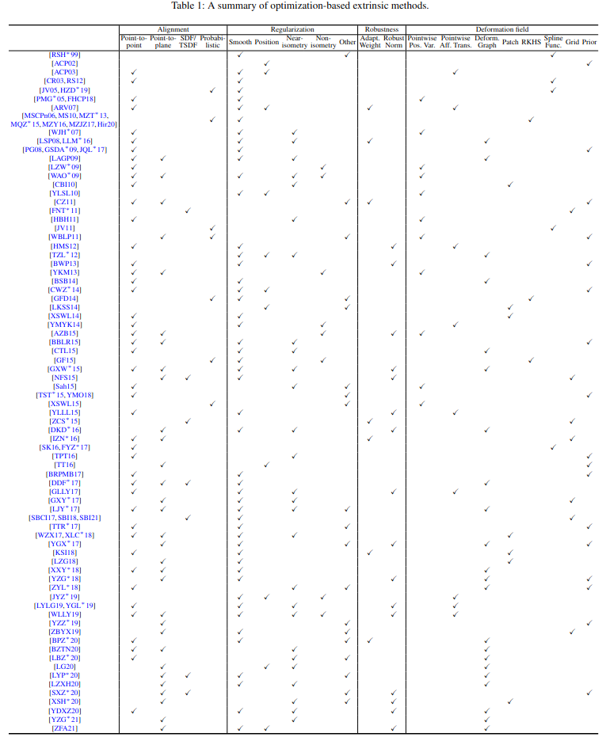
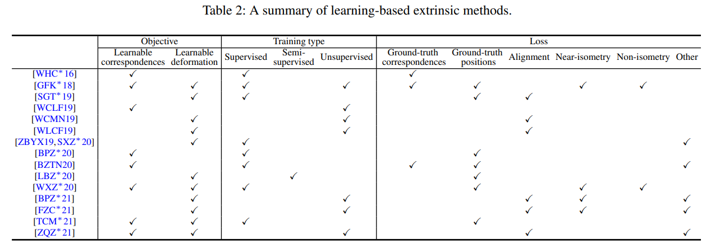
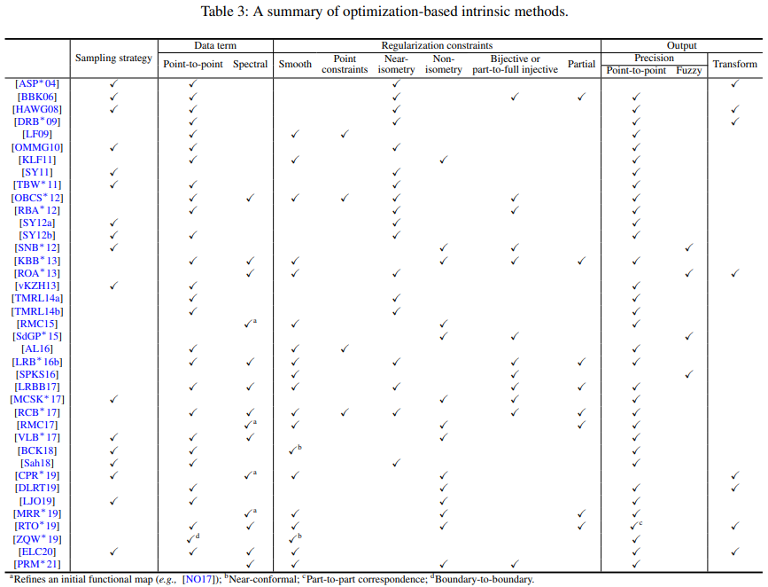
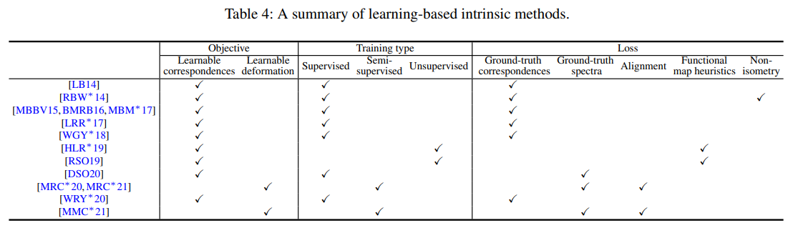
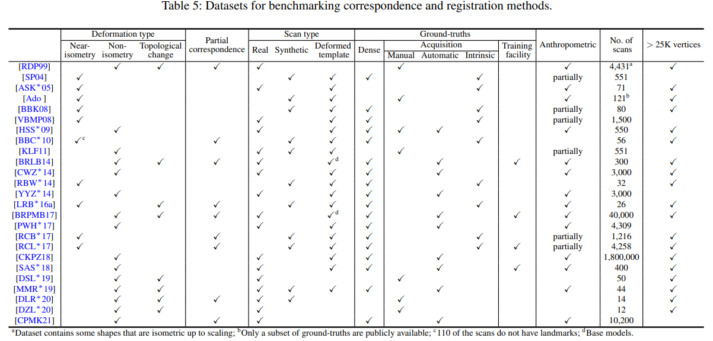

# A Survey of Non-Rigid 3D Registration

This page provides an overview of the following survey paper about non-rigid 3D registration methods from the graphics and vision community:
- [Bailin Deng](http://www.bdeng.me/), Yuxin Yao, [Roberto M.Dyke](http://robertodyke.com/pages/home.php), and [Juyong Zhang](http://staff.ustc.edu.cn/~juyong/). "A Survey of Non-Rigid 3D Registration". To appear in *Eurographics 2022 State-of-the-Art Reports*. [arXiv:2203.07858](https://arxiv.org/pdf/2203.07858.pdf).  

  

## Abstract

Non-rigid registration computes an alignment between a source surface with a target surface in a non-rigid manner. In the past decade, with the advances in 3D sensing technologies that can measure time-varying surfaces, non-rigid registration has been applied for the acquisition of deformable shapes and has a wide range of applications. This survey presents a comprehensive review of non-rigid registration methods for 3D shapes, focusing on techniques related to dynamic shape acquisition and reconstruction. In particular, we review different approaches for representing the deformation field, and the methods for computing the desired deformation. Both optimization-based and learning-based methods are covered. We also review benchmarks and datasets for evaluating non-rigid registration methods, and discuss potential future research directions.

  

## Structure of the Survey
- Introduction
- Representation of the Deformation Field
- Extrinsic Methods
    - Optimization-Based Methods
    - Learning-Based Methods
    - Applications and Systems
- Intrinsic Methods
    - Optimization-Based methods
    - Learning-Based Methods
- Datasets and Benchmarks
- Directions for Future Works

  

## Summary of Works

### Extrinsic Methods

  

  

  

### Intrinsic Methods

  

  

  

### Datasets

  

  

## Citation

    @article{deng2022asurvey,
      title = {A Survey of Non-Rigid 3D Registration},
      author = {Bailin Deng and Yuxin Yao and Roberto M. Dyke and Juyong Zhang},
      journal = {Computer Graphics Forum (Eurographics 2022 State-of-the-Art Reports)},
      year = {2022},
    }

